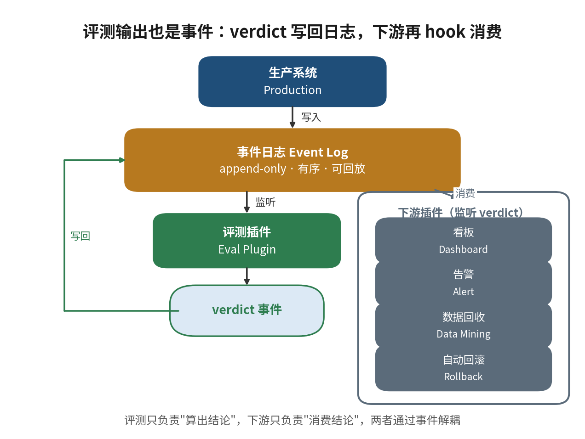
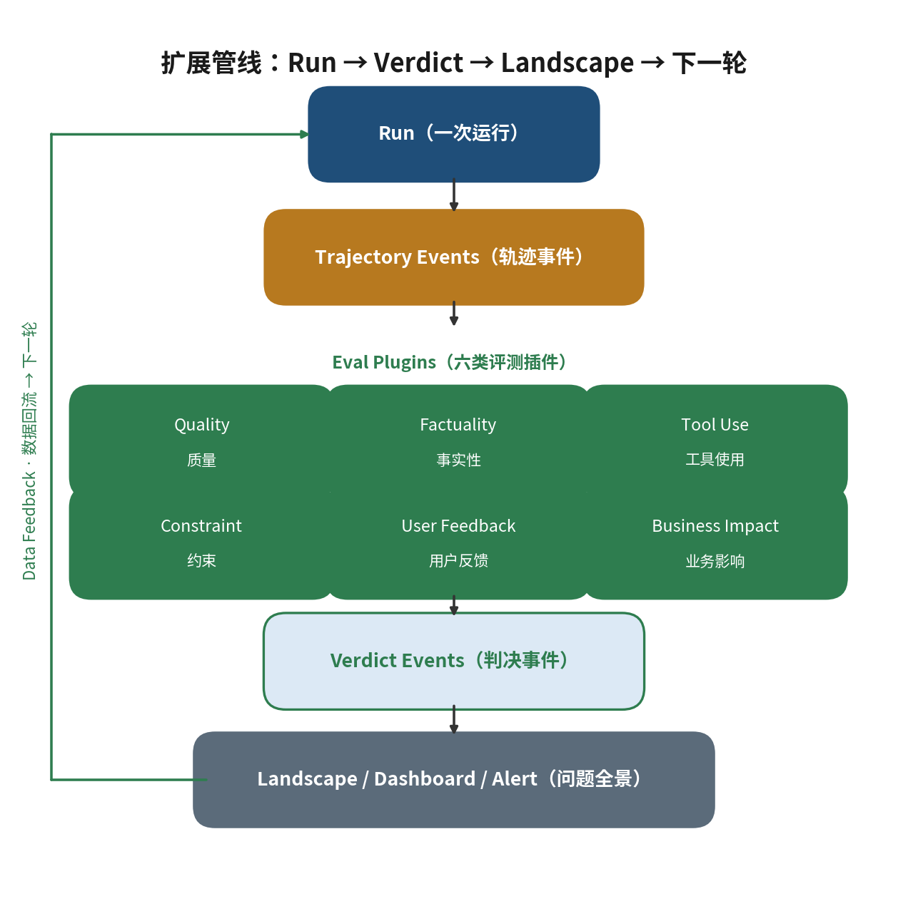
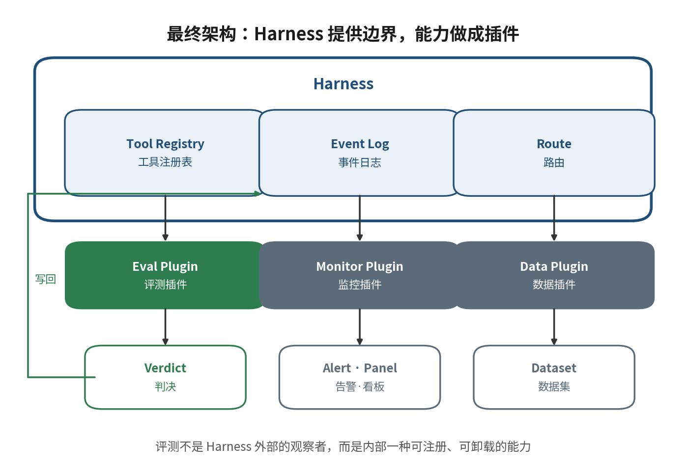

> 来源说明：本文脱胎于 Hugo Zhu 的 DSH 三细节文章与六篇论文的精读笔记，按"定性 → 定量 → 逻辑表达"重写。
>
> **分层阅读指南**（本文严格区分三层，读者可自行判断每一步的跳跃）：
> - —— DSH 的已知事实：来自 Hugo Zhu《一切皆插件：DeepSeek Harness 真正硬核的是三个细节》（https://hugozhu.site/post/2026/348-dsh-three-details-reversible-effects/）与官方表述；
> - —— 从事实提炼的架构抽象：作者的解释性判断；
> - —— 迁移到评测后的设计：作者的架构主张。
>
> 论文证据：DSec（arXiv:2609.22978）、GAUGE（arXiv:2609.12191）、CodeAssay（arXiv:2608.03535）、CCTU（arXiv:2603.15309）、Efficient Benchmarking in Production（arXiv:2609.21267）、How Do Agent Harnesses Create Value?（arXiv:2609.20474）。数字口径见文末"事实核验说明"。

<!--more-->

## 一、定性：Harness 的核心价值不是提供更多能力

**中心命题**：Harness 的核心价值不是提供更多能力，而是**提供稳定的生命周期和事件边界，让能力可以低成本插拔**。评测只是其中一种能力。

DSH 的插件体系：插件注册三种能力——**注册工具**（tools，模型可调用）、**监听事件**（event listeners，订阅生命周期事件）、**挂路由**（routes，对外暴露）。每注册一个能力，同时登记一个对应的清理动作；插件卸载或重载时，能力连带撤销。官方原话：*registrations are effects that unwind when their plugin unloads*。

三个硬细节：① 注册即副作用，卸载即回滚；② Session 是仅追加事件日志（append-only event log），模型可见的一切（工具调用、工具结果、流式 chunk）都从日志推导，每轮写入 request header 快照（供应商、模型名、思考强度、系统提示词、工具目录）；③ 工具调用允许并行完成（并行池默认上限 10），但写回模型的结果按最初调用顺序排列。

三个细节回答的是同一个问题：**一个会不断变大的 harness，怎么才不腐烂？** 答案分两层：

- **生命周期边界**：能力的"生"与"死"对称——注册什么，卸载时就撤销什么。插拔的代价为零，系统才敢让人随便插。这就是"可替换是口号，可回滚才是能力"的完整含义。
- **事件边界**：能力之间不直接调对方，只通过事件交互；事件必须**完整**（模型看见的一切都在日志里）、**有序**（写回按原序）、**可回放**（仅追加、header 快照）。边界稳定，插件才敢假设输入的形状。

所以"DSH 的核心是一切皆插件"这句话——注意，这是我的解释性判断，不是官方表述——真正的意思是：**DSH 把"可插拔"从工程技巧升级成了架构不变量**。三个细节不是三个独立的最佳实践，是同一个不变量的三个侧面。

---

## 二、Eval Plugin Contract：全文最重要的那张表

如果接受上面的推导，评测电路（eval circuit）的形态就被唯一确定了：**它不是 harness 外面的一个系统，它是 harness 里面的一组插件**。合同如下——

| Harness 能力 | Eval 对应物 | 插拔生命周期 |
|---|---|---|
| Tool registration | mock / probe / judge（探针工具） | 注册 → 实验 → 回滚 |
| Event listener | trajectory / scoring / attribution（事件消费） | 订阅 → 消费 → 取消 |
| Route | scores / regression / evidence（结果暴露） | 挂载 → 查询 → 卸载 |

即：**Eval Plugin = Tools + Events + Routes**。

这张表是全文唯一的原创部分，后面六篇论文的任务只有一个：**证明这三个接口值得存在**。论文退到证据层，不承担主叙事。

为什么是这三个、不多不少：工具点解决"评测以什么身份进入系统"（和业务工具平级、可逆）；监听点解决"评测消费什么"（完整有序的事件流）；路由点解决"评测结果去哪"（可挂载、可卸载的暴露面）。少了任何一个，评测就退化成外挂——以外挂方式焊进系统的东西，迟早变成没人敢动的祖传逻辑。

---

## 三、定量：六篇论文证明三个接口值得存在

### 3.1 Tool 接口值得存在：可插拔的末端层，又便宜又有效

How Do Agent Harnesses Create Value?（arXiv:2609.20474，CUHK/Edinburgh）：在 τ²-bench 上做 Fixed vs Sham 规划对照，规划层 harness 带来 **+7.17pp**；终端校验器拦截了 **61% 的 false-pass**，成本 **<$0.01/episode**（以上三个数字见论文摘要、§1.4）。

这正是"注册即副作用"的评测版：校验器作为可插拔、可卸载的一层挂在管线末端——挂上时拦截假通过，摘掉时不留残留、不污染基线。**judge 之后再加一道硬规则校验器**，这个结论很实用；但它必须是可逆的实验层。焊死在管线里，它就从"61% 拦截率"的功臣变成"谁也不敢删"的祖传逻辑——Tool 接口的价值恰恰在于让你永远有"摘掉"这个选项。

CodeAssay（arXiv:2608.03535）：185 个 Python 任务，真值审计后 1,890 个固定输出里 170 个正确性标签翻转（**9.0%**），模型最好与最差的差距从 11.9 拉到 23.7 个百分点；完整/隐藏测试的 mutation score 分别为 82.6%/74.8%（以上数字见论文摘要）。

题库本身也是"注册进系统"的东西。**没审计过的题库，就像没写清理动作的插件**：注册进来容易，悄悄污染你所有的结论，卸载时还不知道从哪下手。可直接抄的三件套：ground truth 审计、公开/隐藏测试隔离、mutation testing。

### 3.2 Event 接口值得存在：记什么，决定了能回答什么

GAUGE（arXiv:2609.12191，Amazon，EMNLP 2026 Industry Track）：25 个 agent（6 家厂商）× 约 3,700 会话。离线评测的"排序"整体可靠（与可验证奖励 Spearman ρ=0.94，见正文），但"满意度"与"任务成功"彻底脱钩——人评"满意"的会话里 **57.5% 实际失败**（见导言；ρ=−0.147）。

"排序有效性"和"构念有效性"是两种不同的事件，要分开落盘、分开审计。混在一起的日志，回放出来也是混的——**监听点再灵，也救不了一个记混了的日志**。Event 接口的第一个价值是倒逼记录纪律：你想回答什么问题，就必须先有对应的事件。

同一个研究里（Table 3；§4/Appendix）：completion bit 与可验证奖励 ρ=0.87，优于付费 judge 的 0.80；实力接近的 pair 在采样噪声内弃权，误判率从 31% 降到 14.8%。

这就是一个教科书级的"监听点插件"：**只读事件、不碰系统，挂上就有收益，摘掉零成本**。先用零成本 tripwire 做回归截断，贵 judge 只用在可疑 case 上——"监听"这个动作本身，就值得是一个独立、可插拔的能力。

CCTU（arXiv:2603.15309）：200 个复杂工具调用案例，12 类约束分属四维，平均每例 7 类约束；九个模型**严格无违规完成率全部低于 20%**（论文导言），所有模型在超 50% 案例中出现约束违规；方法论上把"最终完成"（SR）与"全程无违规"（PSR）拆成两个指标。

过程的中间态是结论的一部分。"成功了但违规了"是线上最常见的中间态，而只看终态的评测会系统性漏掉它。对应到 Event 接口的要求：**监听必须消费有序事件流**——DSH"写回按原序"不是性能细节，是因果卫生。乱序的投影不配做评测输入。

Efficient Benchmarking in Production（arXiv:2609.21267，Meta/CMU）：52 天 574 runs（论文摘要）的实证，对比"难度分层固定子集"与"IRT 自适应测试"两种降本路线。（完整精读待补，此处只用已验证的结论。）

这里措辞要谨慎：论文支持的是"**完整记录输入输出有助于持续评测的可复现性**"，而不是"没有它就一定退化"。但方向是实的：持续评测不是"多跑几次"，而是"每次 run 的输入输出都被完整记录、可对比"——这正是监听点消费 append-only 日志能直接给出的东西。

DSec（arXiv:2609.22978）列出的 7 类平台约束里有"agent 执行不可信"和"执行可中断"。

评测插件必须假设执行会中断、输出不可信；只有可回放、可审计的执行日志能让这两条约束有解。Event 接口的第二个价值：**它是"不可信执行"与"可信结论"之间的唯一桥梁**。

### 3.3 Route 接口：目前主要是设计主张，诚实标注

论文证据主要支撑 Tool 和 Event 两个接口；Route 接口目前是设计上的自然补全，诚实标注为**主张**而非事实：评测结果需要暴露面（scores / regression / evidence），但这个暴露面必须可挂载、可卸载——否则评测面本身会变成永久后门。DSH 安全节的提醒同样适用：**评测插件自己也是插件，按宿主代码标准审查**（三档权限管模型行为；插件权限接近 dsh 进程本身；`web_fetch` 默认关闭）。监听点只读事件，不代表评测插件没有写能力；verdict 写回、路由挂载都是副作用，都要登记清理动作。

---

## 四、逻辑表达：评测输出也是事件

这一节是全文最值得深挖的地方。前面是"评测怎么插进去"，这里是"插进去之后，信息怎么流动"。

**机制**：评测插件监听 harness 事件，它的**输出本身也是事件**。

评测插件在监听点消费：tool call、tool result、message、header 快照。它算分，然后把 verdict **以事件的形式写回日志**（例如一条 `eval.scored` 事件，带上引用的 log 区间、分数、judge 身份）。因为日志仅追加且有序，这条 verdict 事件和它依据的生产事件在**同一条因果链**上：可回放、可审计、可归因。

**判断 1：下游可以再 hook 评测的输出，形成闭环。**

verdict 事件写进日志后，别的插件监听它：看板只画趋势、告警只负责喊、数据回收把高分 trajectory 收进题库、自动回滚把严重回归变成生产动作。**评测只负责"算出结论"，下游只负责"消费结论"，两者通过事件解耦。** 这已经不是"评测系统怎么做"的问题，而是：**把评测变成 Harness 的一种可组合能力**。

**判断 2：这套模型可以直接套进"评测电路 → Landscape → Harness"的思路。**

之前一直在考虑的链路——评测结果 → 问题全景 → 归因 → 优先级 → 行动——用这篇文章的模型重写一遍，架构更统一：

对比"评测平台里堆很多分析组件"的做法：组件之间是调用关系，换一个就伤筋动骨；插件之间是事件关系，**摘掉告警插件，评测不受影响；换掉 judge 插件，verdict 的事件格式不变**。Landscape（问题全景）不再是一个"平台功能"，而是一个"监听 verdict 事件的插件"——这正是"评测 × 生产是一条路"在架构上的表达：生产事件 → 评测 → 下游消费 → 数据回流 → 下一轮生产。

**判断 3：最终架构。**

**可逆性是整条链成立的前提**：链上每个插件都满足"卸载即回滚"。评测插件摘掉，verdict 不再产生，但历史 verdict 仍在日志里（仅追加，不可删）；告警插件摘掉，通知停止，评测不受影响。任何一环可逆，实验才敢做；A/B 对比的才永远是同一个系统。

**一句话命题**：评测不是 Harness 外部的观察者，而是 Harness 内部一种**可以被注册、消费事件、产生事件、并随时卸载**的能力。

---

## 五、落到日常工作的清单（按"今天就能做"排序）

1. **把评测插桩改成插件注册**：mock、judge、打点走"注册即副作用"，随实验卸载而回滚；做 A/B 前先确认基线没被历史实验污染。
2. **Trajectory 日志升格为评测脊柱**：每次 run 落盘 request header 快照 + 仅追加事件流。这是监听点的输入，也是线上问题追踪的"第一现场"。
3. **评测输出写成事件，不只写数据库**：verdict 带上引用的 log 区间和 judge 身份写回日志，下游（看板、告警、数据回收）才能 hook 消费。
4. **题库先审计再卷模型**（CodeAssay）：9% 标签翻转率说明，真值不审计，模型排名可能只是在给脏题库打工。公开/隐藏测试隔离 + mutation score 做题库健康度指标。
5. **指标拆分：SR 与 PSR 分开报**（CCTU）：任务成功率之外单独报"全程无违规率"。九个模型严格无违规完成率均 <20%——线上要的恰恰是这个视角。
6. **CI 里放零成本 tripwire**（GAUGE）：completion bit（ρ=0.87）先做回归截断，贵 judge 只用在可疑 case；实力接近的 pair 在采样噪声内弃权（误判率 31% → 14.8%）。
7. **评测末端加终端校验器**（Harnesses Create Value）：硬规则拦截 61% false-pass，成本 <$0.01/episode；但必须做成可插拔的实验层，不是焊死的祖传逻辑。
8. **持续评测降本二选一**（Efficient Benchmarking）：难度分层固定子集 vs IRT 自适应测试，52 天 574 runs 实证在前——完整精读补上后再定。
9. **并行评测的写回顺序**（DSH 细节三）：异步 judge、多并发 run 的结果写回保持调用原序；顺序抖动不报错、只让结论悄悄变味，review 时重点看这一层。
10. **评测插件按宿主代码审查**：verdict 写回、路由挂载都是副作用，登记清理动作；日常用工作区可写 + 逐次审批。

---

## 六、关键术语中英对照

| 中文 | 英文 |
|---|---|
| 可插拔 / 插件点 | pluggable / plugin point |
| 评测插件合同 | Eval Plugin Contract |
| 注册即副作用 / 可逆副作用 | registrations are effects that unwind / reversible effects |
| 仅追加事件日志 | append-only event log |
| 请求头快照 | request header snapshot |
| 评测电路 | eval circuit |
| 判决事件 | verdict event |
| 问题全景 | Landscape |
| 假通过 | false-pass |
| 终端校验器 | terminal verifier |
| 完成位（零成本截断信号） | completion bit |
| 真值审计 | ground truth audit |
| 变异分数 | mutation score |
| 排序有效性 / 构念有效性 | ranking validity / construct validity |

---

## 附：论文与文章来源

- Hugo Zhu《一切皆插件：DeepSeek Harness 真正硬核的是三个细节》https://hugozhu.site/post/2026/348-dsh-three-details-reversible-effects/
- DeepSeek《DeepSeek Elastic Compute (DSec): A Sandbox Infrastructure for Effective Agentic Training at Scale》arXiv:2609.22978（§1 中英对照精读已入库）
- Amazon《GAUGE: When Not to Trust LLM-as-a-Judge in User-Simulated Evaluation of Task-Oriented Agents》arXiv:2609.12191（精读已入库）
- 《CodeAssay: A Multi-Metric Benchmark with Audited Ground Truth for LLM Code Generation》arXiv:2608.03535（中文精读）
- 《CCTU: A Benchmark for Tool Use under Complex Constraints》arXiv:2603.15309（中文精读）
- Meta/CMU《Efficient Benchmarking in Production》arXiv:2609.21267（精简版；完整精读待补）
- CUHK/Edinburgh《How Do Agent Harnesses Create Value?》arXiv:2609.20474（精简版）

### 事实核验说明（2026-10-05 已逐条回论文原文核验）

13 个数字全部与原文一致，无需改口径：

- +7.17pp / 61%（83/137）/ <$0.01（2609.20474，摘要 + §1.4）
- 9.0%（170/1890）/ 11.9→23.7pp / 82.6%/74.8%（CodeAssay，摘要）
- 57.5% / ρ=−0.147（GAUGE，导言）；ρ=0.94（正文）；ρ=0.87 / 0.80（Table 3）；31%→14.8%（§4/Appendix）
- 52 天 574 runs（2609.21267，摘要）；<20%（CCTU，导言）

口径修正："一轮 14 步任务 93% 缓存命中率"为 Hugo Zhu 文章中的作者实测数据，非 DSH 官方 benchmark（正文已不引用）；"没有快照+日志则持续评测退化"已弱化为论文实际支持的版本。
