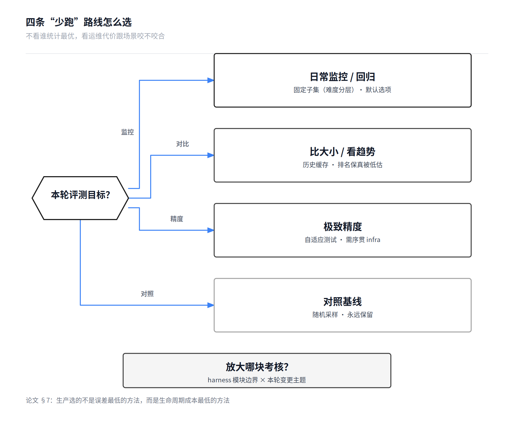
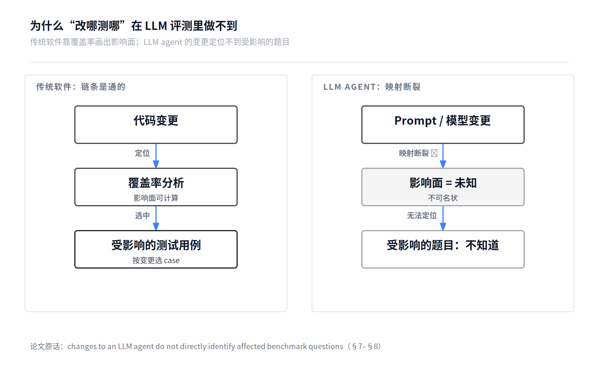
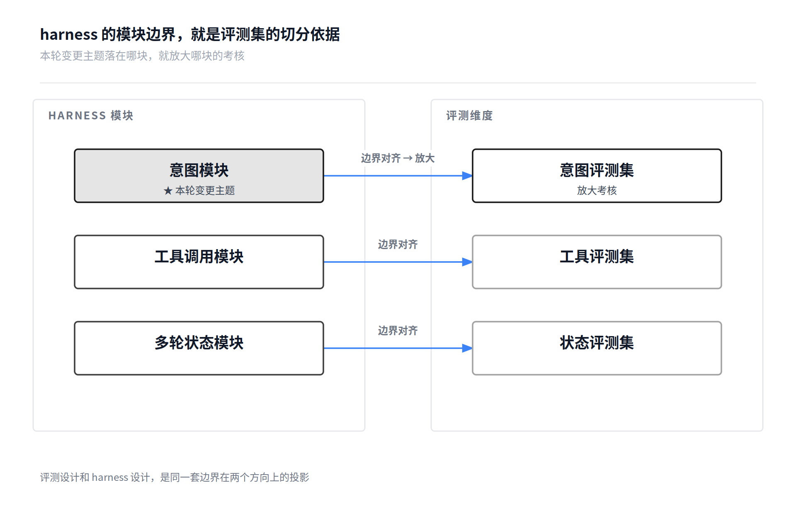

> 论文：Yining She（CMU）、Lei Lin（Meta），arXiv:2609.21267（2026-09-18）
> 这是"评测×生产"系列的第一篇，讲生产环境持续评测的框架：全量跑不起的时候，怎么"少跑"才对。第二篇已发布：《[同样的评测预算，能不能买到更准的分数？](/post/2026/002-speculative-evaluation-stochastic-llms/)》。

<!--more-->

## 一、生产评测的真问题：全量跑不起

这篇论文来自 Meta 一个生产级 analytics agent 的实战：服务数万月活用户，核心 benchmark **519 道题，单次全量跑约 3 小时**。52 天里攒了 574 次 benchmark run。作者们想回答的问题很实在：**能不能少跑，还保住评测的可信度？**

他们比较了四条"少跑"的路线：随机采样、历史缓存、固定子集、自适应测试。先把每条路线的机制讲透——这是全文的硬核部分，选型表在后面。

## 二、四条路线：机制、数据、代价

### 路线一：随机采样——baseline，零成本

**怎么做**：每轮从 519 题里均匀抽 k 道，跑完直接报这 k 道的通过率（§3.1，无权重估计）。

**数据**：k=100（19.3%）时 MAE 2.94pp；k=400（77.1%）时 0.69pp。方差大，小预算下最不划算。

**代价**：零。不需要历史数据，不需要模型，不需要改 infra。

**适合谁**：只配当对照组。任何新方法的第一个问题都应该是"比随机采样好多少"。

### 路线二：历史缓存——复用"稳如泰山"的题

**怎么做**（§3.3.2）：维护一个回看窗口，看每道题在近期 run 里的表现。如果一道题**一直过或一直挂**（历史通过率 ȳ 满足 min(ȳ, 1−ȳ) ≤ ε，即足够稳定），就直接复用它最近的多数表决结果，不跑；剩下的才真正执行。

**数据**：很分裂。保**分数**很差（20.3% 执行量下 MAE 高达 7.36pp）；保**排名**极好（同样执行量下 Spearman 0.905）。

**代价**：需要 outcome 存储 + **过期监控**。论文 §7 原话："requires recent outcomes and monitoring for stale verdicts"——agent 一进化，缓存的结论就会过期，没人盯就会 silently wrong。

**适合谁**：你的评测主要用来"比出哪个改动更好"（看趋势、排顺序），而不是"报出精确分数"。这是一个被低估的选项。

### 路线三：固定子集——论文最终部署的方案

**怎么做**（§3.3.3），分两步：

1. **选集**：在 calibration run 上拟合 Rasch 模型，得到每道题的难度 β；按难度排序分成 k 层，每层取最接近中位难度的那道题。k=100/200/300/400 四档，一次选好，以后每次跑同一批。
2. **估计**：不只看子集的加权通过率，还用 gp-IRT 把**没跑的题**用 IRT 模型重建出来，两边按 λ 混合——采样方差和模型偏差之间取平衡。

**数据**：小预算下最优。k=100 时 MAE 2.65pp（随机采样 2.94pp）；k=200 时 1.40pp。

**代价**：几乎零维护，但有两条纪律（§7 原文）："recalibrating after material changes to its models, prompts, tools, or execution system"——**模型、prompt、工具、执行系统有实质变更就重校准**；以及"periodically run the full benchmark"——**定期全量跑一次对表**，度量日常监控引入的误差。

**适合谁**：日常监控/回归的默认选项。workload 跑之前就可预知，每次跑同一批题方便题级对比和诊断，而且**天然适配并行执行的评测系统**——这正是论文部署它的原因。

### 路线四：自适应测试——统计最优，但要序贯调度

**怎么做**（§3.4）：先标定每道题的难度 β；新 run 开始时设 agent 能力 θ̂=0。每一步：对每道没跑过的题算预测通过率 p=σ(θ̂−β)，取 Fisher 信息量 I=p(1−p) 最大的那道执行；根据结果更新 θ̂；跑满 k 题停止。多维 2PL 版本用 D-optimal 选题目。

**数据**：全预算统计最优。k=200（38.5%）时 MAE **1.03pp**；k=300 时 0.58pp。

**代价**：论文 §7 原话——"requires sequential orchestration, run-specific state, and repeated ability updates"。**要序贯调度（跑完一道才知道下一道跑哪道，并行度天然受限）、要 run 级状态、要反复更新能力估计**。infra 复杂度是四条路线里最高的。

**适合谁**：要极致精度、且 infra 撑得起序贯调度时。

## 三、论文的选型逻辑：看运维代价，不看统计最优

四条路线的数据摆完，论文做了一个"反直觉"的决定。摘要里那句 "nevertheless" 是全文最诚实的一个词：

> "multidimensional 2PL adaptive testing achieves the best overall score fidelity: executing 200 questions, 38.5% of a full run, yields 1.03 pp of MAE. **We nevertheless deployed difficulty-stratified fixed subsets because of their operational simplicity**."
> —— 中文：多维 2PL 自适应测试总体精度最优，跑 200 题（38.5%）只有 1.03pp 误差。**但我们最终部署的还是难度分层固定子集，因为它运维简单。**

§7 把选型逻辑说透了："Production deployment requires considering operational properties alongside statistical fidelity."（生产部署要把运维属性和统计精度一起考虑。）

| 你的目标 | 路线 | 一句话 |
|---|---|---|
| 日常监控 / 回归 | 固定子集（难度分层） | 默认选项：一次构建几乎零维护，题级可比，适配并行 |
| 比大小 / 看趋势 | 历史缓存 | 排名保真被低估；代价是 outcome 存储 + 过期监控 |
| 极致精度 | 自适应测试 | 统计最优；代价是序贯调度 + run 级状态 |
| 对照基线 | 随机采样 | 永远保留，当对照组 |

**生产选的不是误差最低的方法，而是生命周期成本最低的方法。**

## 四、我的思考：harness 的模块边界，就是评测集的切分依据

论文讲到这里已经很完整了。但有一个问题它**没有回答**：为什么作者有 574 次 run 的历史数据，却不按"本轮改了什么"动态选评测集？比如这轮主要在弄意图，就重点跑意图相关的题——这不是更显然吗？

论文 §7 藏了答案，先上原文：

> "Conventional regression testing seeks faults using signals such as coverage or change impact, but **changes to an LLM agent do not directly identify affected benchmark questions**."
> —— 中文：传统回归测试靠覆盖率或变更影响面定位 fault，但 **LLM agent 的变更，无法直接定位到受影响的 benchmark 题目**。

在传统软件里，代码改动 → 覆盖率 → 影响面，链条是通的，所以"按变更选 case"做了三十年。但在 LLM agent 这里，prompt 改一句、模型换一个版本，哪几道题会挂？没人知道。**映射是断的。**

> 以上"映射断裂"是论文 §7 的原意转述。以下是我个人的架构推导，不是论文的结论——论文没有验证"按变更主题选集"。

但映射断，不等于永远断。断的原因是变更没有"定界"：一次 prompt 修改的影响散落在整个 agent 行为里，不可名状，自然没法定位。

如果 harness 本身是模块化的呢？意图识别就是意图模块，工具调用就是工具模块，多轮状态就是状态模块。这时候"本轮变更的主题是意图"这句话，天然就对应一批评测题：意图评测集。**harness 的模块边界，就是评测集的切分依据。**

这也是我深读 DeepSeek Harness 时一直在想的事：如果评测作为插件，插在 harness 的生命周期边界上（Eval Plugin = Tools + Events + Routes），那么变更发生的位置、影响的范围，在边界上是可见的。**评测设计和 harness 设计，是同一件事的两面。** 你 harness 拆成什么模块，评测集就切成什么维度——这不是巧合，是同一套边界在两个方向上的投影。

落到行动，三条可抄的：

1. **先按能力维度组织题库**：意图、工具调用、多轮、长上下文……题库先有维度，才谈得上"放大某维度的考核"。没维度的题库，变更主题来了也无处放大。
2. **评测维度对齐 harness 模块边界**：harness 拆成什么模块，评测集就切成什么维度。本轮变更主题落在哪块，就放大哪块的考核——这是"改哪测哪"在 LLM agent 世界里的可操作版本。
3. **静态打底 + 动态放大**：平时用固定子集做日常监控（论文已验证，运维简单）；本轮变更主题对应的维度加跑/加权；重大变更后重校准，定期全量跑一次对表。

## 五、诚实地说

- **"按变更主题选集"是我的推导，论文没有验证。** 论文验证的是两件事：静态子集可行（难度分层固定子集）、难度标尺可跨 agent 迁移。"harness 模块边界即评测切分依据"是我从这两件事推出来的，逻辑上说得通，但缺生产数据的验证——这恰好是我们可以在自己业务里验证的东西。
- 论文也没做发布门禁的阈值分析（漏报回归、误报、与全量决策的一致性），而这恰恰是生产评测最常用的形态。作者在 Limitations 里自己写了：
> "Future work should add threshold-based analyses that measure **missed regressions, false alarms, and agreement with decisions based on the full benchmark**."
> —— 中文：未来工作应该补上基于阈值的分析，度量**漏报的回归、误报，以及与基于全量 benchmark 的决策的一致性**。
>
> 这是下一步可以补的一块，也可能是我们自己的实践能回答的。
- "一天校准窗口就够"（14 个 run 的 MAE 1.41 vs 287 个 run 的 1.40）的前提是成熟期的 agent；快速迭代期的结论可能不同，作者自己也承认了。照抄之前先看自己处在哪个阶段。

---

*下一篇预告：DSec（sandbox infra）——生产侧的地基。评测想"少跑"，沙箱得先稳。*
