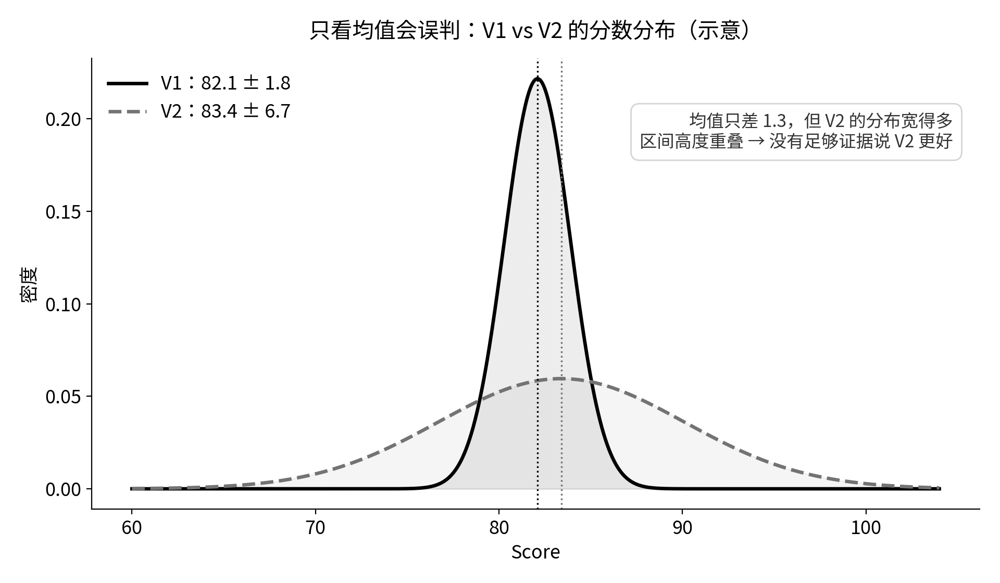
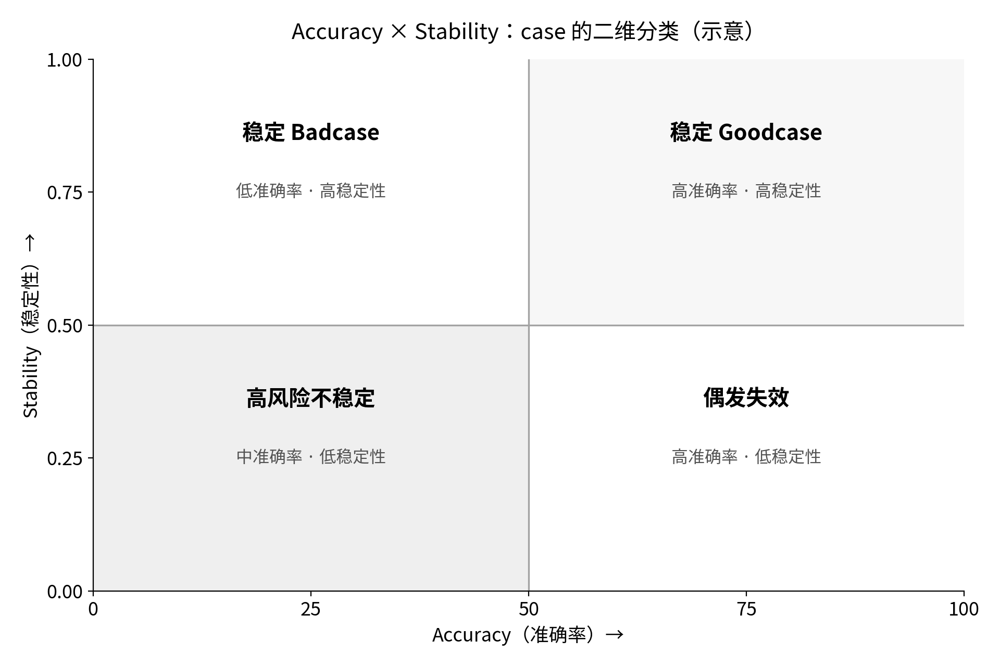
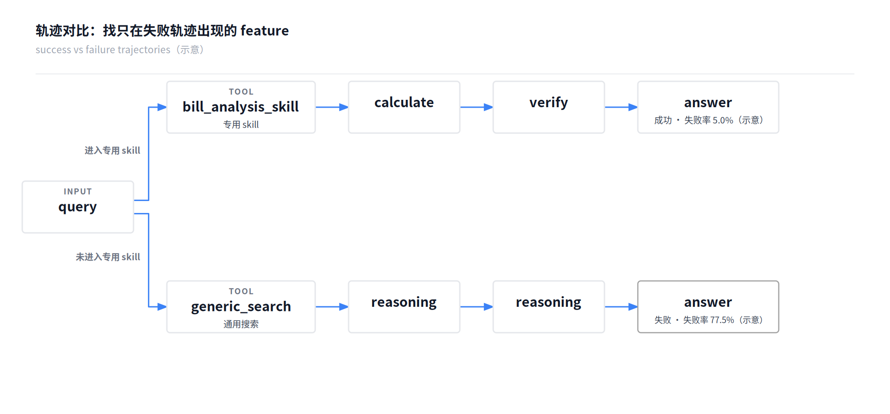
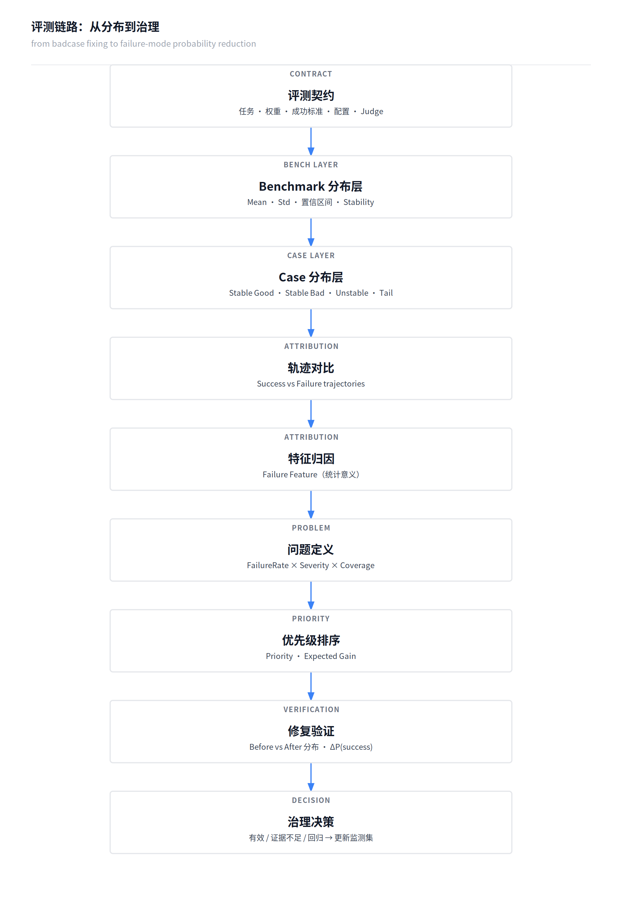

> 触发：《Agents Are Systems, Not Models: Rethinking Agentic Evaluation》（arXiv:2610.01618，18,000+ trajectories）。
> 方法细节见内部方法文档《Agent 评测从单次分数到概率分布：Bench 稳定性与 Badcase 治理方法》v1.0（2026-10-05）。
> 分层说明：约 54% 方差是噪声——这是论文的事实；下文的公式、分类、两阶段设计——都是我的架构主张，不是论文结论。

昨天读这篇论文时，一个数字把我钉住了：**约 54% 的 outcome variance 来自同配置重复运行**——什么都不换，重跑一次，一半以上的分数波动是纯噪声。

我第一反应是后背发凉：过去我报过的那些"涨了 2 分"的版本对比，有多少是真的？

第二个问题更扎心：如果分数本身是概率分布，那"badcase"到底是什么？Case 跑一次失败就修，修完跑一次通过就叫修好了——**这套流程在分布视角下，全是错的。**

这篇文章，是我顺着这两个问题推出来、又按统计口径打磨过一遍的完整框架。

**中心命题：以后不是"修一个 badcase"，而是"降低一种 failure mode 的发生概率"。**

<!--more-->

---

## 一、定性：单次分数为什么不可靠

一次成功或失败，只是一次观测。同一个 case 跑五次，结果可能是成功、失败、成功、失败、成功——只看第 1 次会忽略已有风险，只看第 2 次也无法判断它是否总是失败。更诚实的记录是：**5 次成功 3 次，观测成功率 60%，证据仍有限。**

### 先拆开三种波动，因为它们修法完全不同

- **Agent 波动**：相同条件下，决策或执行路径变化。修决策。
- **环境波动**：数据、服务可用性、工具返回或时序变化。修基础设施或重试。
- **Judge 波动**：同一条保存的轨迹，被重复评分后得到不同判断。修评分器。

**不能把所有变化都归因给模型。** 混在一起，全是误杀。

### 开始计算前，先固定评测契约

Case 集及权重、成功标准、模型与 Prompt 版本、工具版本、运行预算、初始状态、Judge 版本——新运行要重置可变状态，无法固定的外部条件要记录并分层分析。契约不定，后面所有数字都不可比。

### Badcase 重新定义

一个 Badcase 条目至少包含三个维度：

**BadCase = FailureProbability × Severity × Coverage**

- FailureProbability：在规定条件下失败的概率（失败次数/总次数、估计值、CI、时间窗口）
- Severity：失败的业务后果（后果说明、统一等级）
- Coverage：受影响场景的范围——**必须说明分母**。"覆盖 18% 的评测 case"不等于"影响 18% 的线上流量"。

注意：`RiskScore = FailureRate × Severity × Coverage` 只是辅助排序的乘积评分，不是 Badcase 的统计定义。Severity 用 1～5 等级时，乘积也不是实际损失的精确估计。

同样跑 10 次，失败 10 次、5 次、1 次的 case，完全不是一种问题：

| 类型 | 概念表现 | 治理含义 |
|---|---|---|
| Stable Good | 成功率高，证据充分 | 可靠能力，留作回归保护集 |
| Stable Bad | 成功率低，反复失败 | 持续失败，先查任务和 Judge 再修 |
| Unstable | 成功与失败混合 | 对执行路径敏感，比较成功/失败轨迹 |
| Tail Failure | 失败率低但有可核实证据 | 低频风险，按严重度追加采样和防护 |

分类阈值（比如 Stable Good 要求 p≥95%）只是团队约定的示例，不是通用标准。**证据不足时写"暂定分类/待补样"，不要强行定类。** 10 次全通过，只能写"本轮未观察到失败"，不能据此确认 Stable Good。

---

## 二、定量：两层指标、四步归因、双重验收

### Bench 层：Mean、Std、Pass Rate、CI

同一版本在同一批 case 上重复跑，最少保留四个指标。**先别混淆三个目标**：固定 Bench 的轮次波动、单个 Case 的成功概率、面向更广泛任务总体的泛化能力——三者的抽样单位和置信区间都不同。

工程报告优先看 Std（与分数同单位），而不是方差。比如：

| Version | Avg | Std |
|---|---:|---:|
| V1 | 82.1 | 1.8 |
| V2 | 83.4 | 6.7 |

你不能简单说 V2 更好。更准确的说法是：**V2 平均能力略高，但稳定性明显恶化。**



版本比较要直接算差值：`Δ = After − Before`，报告 Δ、Δ 的 CI、样本量和计算方法。**两个版本各自的 CI 是否重叠，不能直接判断差异是否成立**——配对观测要保留配对关系，再估计差值区间。R=1 时根本算不出轮次 Std，R=2 时的估计也很不可靠。

### Case 层：Unstable 是重点，但不是无条件最高优先级

**我建议重点关注 Unstable Badcase。** 同一个 case 跑 5 次 3 对 2 错——以前如果刚好只跑第 1 次，会判成 Goodcase；只跑第 3 次，会判成 Badcase，两种都是误判。真正的问题定义应该是：**这个 Agent 在该场景下缺乏稳定策略**。

但要克制："有时成功"不直接证明 Agent 缺乏稳定策略，环境和 Judge 也可能造成混合结果。**Unstable 是重点诊断对象，不应无条件获得最高修复优先级**——低频高严重度故障或持续失败问题，可能更急。

给每个 case 算 Stability Score：**Stability = 1 − 4p(1−p)**。p=1 和 p=0 都是 1——**永远错也是"稳定"的**，所以必须跟 Accuracy 组成二维：



两个限制：小样本可能把观测成功率错估为 0 或 1，产生虚假的高稳定分；即使结果稳定，执行路径、成本和延迟也可能不稳定。

### 归因：从轨迹差异，到统计关联，再到干预验证

链路是五步：Repeated Runs → Outcome Distribution → Trajectory Distribution → Failure Pattern → Attribution。**不要只分析失败的那一次 trajectory**——Unstable case 的价值恰恰在于它同时有成功路径和失败路径，直接材料都在手里。

教学示例（100 次可比运行）：

| 轨迹特征 | 成功 | 失败 | 总次数 | 条件失败率 |
|---|---:|---:|---:|---:|
| 进入账单能力 | 57 | 3 | 60 | 5.0% |
| 未进入账单能力 | 9 | 31 | 40 | 77.5% |



这支持一个候选假设："未进入账单能力"与较高失败率相关——但**不证明路由就是根因**，较难的输入也可能同时影响路由和结果。归因记录分三栏：**观察事实、解释假设、验证结果**。证据等级是：轨迹差异 → 统计关联 → 干预支持。只凭一条失败 Trace，不要写成确定因果结论。

### 验证：ΔSuccessRate 和 ΔFailureMode 都要报

单次 `Before 失败 → After 成功`，无法排除随机变化。验收要同时看：

```text
ΔSuccessRate = p_after − p_before    （最终成功增加了吗）
ΔFailureMode = q_before − q_after    （目标模式减少了吗）
```

两者都要报告样本量和差值区间。**目标模式减少了，但计算错误增加了，不能据此称任务已修好。**

还有一个反直觉的点：二元结果的方差是 p(1−p)，成功率从 0.1 升到 0.5 时方差必然增加，但质量在改善——**不能要求所有有效修复都满足"方差下降"。**

CI 包含 0 时，写"当前证据不足以确认改善"，不能写成"两版本等价"。"没有检出显著回归"也不等于"已经证明没有回归"。

---

## 三、逻辑表达：两阶段、优先级、完整链路

### 两阶段 Bench：成本和统计效力的折中

- **Main Bench**：全量 case 各跑 1～2 次，只做筛查，不能证明稳定性。
- **Stability Bench**：触发的 case 累计到 5～10 次，暴露波动、收集成功与失败轨迹。
- 触发条件：本轮失败 / 历史不稳定 / 版本前后结果变化 / 高严重度 / 归因证据不足，外加一个固定或随机的监测子集，避免只盯着已失败的 case。

**5～10 次是初筛预算，不是稳定性证明。** 失败率为 1% 的问题，跑 10 次只有约 9.6% 的概率撞见一次；想以 95% 概率撞见，至少需要 299 次。10 次全通过，对应失败率的 95% 上限仍有约 25.9%——"没观察到"不等于"风险很低"。

正式 Main Bench 分数用预先约定的运行次数；按筛查追加的 Stability 运行**不直接回灌正式分数**，正式验收用新运行和预设样本预算。

### Priority 与 Expected Gain

**Priority = FailureRate × Severity × Coverage × Fixability**，按失败模式排序。使用时检查三点：FailureRate 若已按全流量计算就别再乘 Coverage；Fixability 是待验证的估计，要记录依据并另列工期成本；高严重度事件设独立处置门槛，别让低概率把它压到队尾。

价值表达从"修了 12 个 badcase"升级为 Expected Gain：

> 在目标场景与评测条件下，成功率从 A 提升至 B，增加 Δ 个百分点；目标 failure mode 发生率从 C 降至 D；按本周期场景流量估算，新增成功约 X 次。

但要诚实：**减少一种失败模式，不保证这 250 次都变为成功**——它们可能出现其他失败。只有同时测得最终成功率上升，才能估计新增成功。修复前称"预计收益"，修复后称"实测估计收益"；保留负值，不能把回归截为零。

### 完整链路



**一句话命题：以后不是"修一个 badcase"，而是"降低一种 failure mode 的发生概率"。**

### 检查清单（精简版）

- [ ] 固定评测契约：Case、权重、成功标准、配置、初始状态、Judge；记录无法固定的条件。
- [ ] Main 全量 1～2 次筛查；重点 case 累计 5～10 次；保留固定/随机监测子集。
- [ ] Bench 报 Mean、Std、Pass Rate、CI，说明统计单位和方法；版本比较算 Δ 的 CI。
- [ ] Case 记录失败率、Severity、Coverage（说明分母）、模式分母和分类证据状态。
- [ ] 归因分开记观察事实、原因假设、验证结果；证据等级：轨迹差异 → 统计关联 → 干预支持。
- [ ] 验收同时报 ΔSuccessRate 和 ΔFailureMode，含样本量、差值 CI；检查其他模式、成本、延迟。
- [ ] 单次 Pass 不结案；CI 含 0 则补样或保留为待验证。

### 边界

这套框架目前最薄的三处，都已经在上面的正文里钉死了：Severity 和 Fixability 需要操作定义（rubric + 生产数据反推）；触发器本身会被噪声污染（连续两版都挂，或偏离基线 k 个 σ）；分布是带 config 条件的（同一 case 在不同配置下失败率可能完全不同，修之前先看配置身份）。

---

## 关键术语中英对照

| 中文 | 英文 |
|---|---|
| 失败概率 | failure probability |
| 失败模式分布 | failure mode distribution |
| 稳定坏例 / 不稳定坏例 / 长尾坏例 | stable / unstable / tail badcase |
| 失败特征（统计意义） | failure feature |
| 问题优先级 | problem score |
| 预期收益 | expected gain |
| 评测契约 | evaluation contract |

---

*系列索引：第一篇《[harness 的模块边界，就是评测集的切分依据](/post/2026/003-harness-module-boundary-eval-split/)》· 第二篇《[同样的评测预算，能不能买到更准的分数？](/post/2026/002-speculative-evaluation-stochastic-llms/)》*
